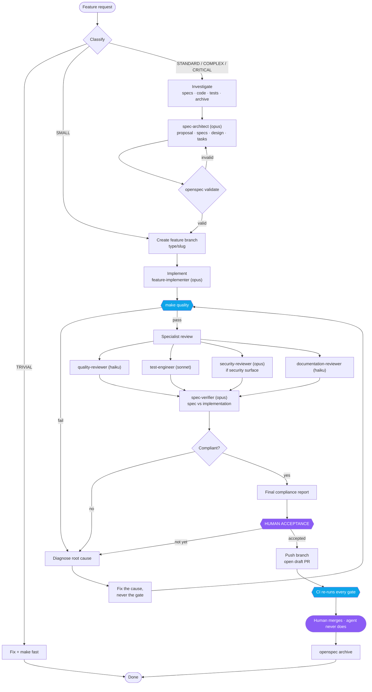

# Autonomous development architecture

How a request becomes a merged pull request in this repository, and which
mechanism is responsible for which guarantee.

The design answers one question: **how do you give an agent enough freedom to
be useful without giving it enough freedom to be dangerous?** The answer here
is that freedom is broad inside the repository and narrow outside it, and that
every guarantee which matters is enforced by something deterministic rather
than by the model remembering to behave.

---

## The feature lifecycle



The two purple nodes are the only points where a human is required. Everything
between the request and the compliance report runs without interruption,
including diagnosing and fixing its own failures.

---

## Who is responsible for what

The mechanisms are not interchangeable. Each one exists because it can enforce
something the others cannot.

| Mechanism | Nature | Jurisdiction |
|---|---|---|
| **`AGENTS.md` / `CLAUDE.md`** | always-loaded rules | Codex / Claude Code constitutions |
| **Skills** | loaded on demand | reusable competence — how to do a kind of work well |
| **Subagents** | isolated context | specialisation and independent judgement |
| **Hooks** | deterministic, pre-execution | guarantees that must not depend on the model |
| **`make quality`** | deterministic, on demand | the definition of done |
| **pre-commit** | deterministic, at commit | irreversible harm, even without an agent |
| **CI** | deterministic, at merge | the remote check that does not trust the agent |
| **OpenSpec** | versioned artifacts | what the system must do, and the historical record |

### Constitutions — `AGENTS.md` and `CLAUDE.md`

Permanent, universal rules only: the definition of done, change
classification, git discipline, code standards and the human gate. Codex loads
`AGENTS.md`; Claude Code loads `CLAUDE.md`. They carry the same permanent
rules for their respective runtimes, so tutorials do not belong in either.

### Skills — competence, loaded on demand

| Skill | Carries |
|---|---|
| `spec-driven-workflow` | classification, the lifecycle, escalation, the compliance report |
| `pocketledger-architecture` | layer rules, ownership scoping, domain invariants |
| `python-best-practices` | code standards, and what the tools cannot check |
| `testing-and-coverage` | fixtures, the PostgreSQL requirement, coverage honesty |
| `repository-security-audit` | the systematic security review method |

Each is a slim entry point with a `references/` directory behind it, so the
detail costs nothing until it is needed.

The `openspec-*` skills are generated by OpenSpec itself and duplicate the
`/opsx:*` commands. They are hidden from the model's listing via
`skillOverrides` rather than deleted, because `openspec update` would restore
them.

### Subagents — isolation and independent judgement

| Agent | Model | Why this model |
|---|---|---|
| `spec-architect` | opus | requirements and design decide the change's real cost |
| `feature-implementer` | opus | cross-cutting judgement across layers |
| `spec-verifier` | opus | must find what everyone else missed |
| `security-reviewer` | opus | the defects here are invisible to tests and linters |
| `test-engineer` | sonnet | intermediate judgement about what is worth testing |
| `quality-reviewer` | haiku | mechanical review; escalates when a finding is architectural |
| `documentation-reviewer` | haiku | verification against a diff |

The important structural property: **`spec-verifier` is never the agent that
implemented the change.** Whoever wrote the code already believes it is
correct, and that belief is what makes self-verification worthless.

### Cross-LLM skills

The project versions the shared skills once: Claude Code reads the canonical
`.claude/skills/` tree and Codex reaches that exact tree through the relative
`.agents/skills` symbolic link. A shared skill is therefore edited once and
both runtimes receive it. The workflow skill tells each runtime which
constitution to use (`AGENTS.md` for Codex and `CLAUDE.md` for Claude Code).
The infrastructure test rejects a copied Codex skill tree. Codex profiles and
hook configuration are versioned under `.codex/`; Claude Code uses
`.claude/agents/` and
`.claude/settings.json`. Both carry the same seven review roles and the
workflow guards, so a clone can use either agent without personal setup.

### Hooks — the deterministic layer

| Event | Runs | Enforces |
|---|---|---|
| `PreToolUse` (Bash) | `scripts/guard-bash.py` | blocks irreversible git operations, privilege escalation, deletion or search outside the repository, credential reads, data-destroying commands and merging; asks before publishing |
| `PreToolUse` (Edit/Write) | `scripts/guard-write.py` | blocks writes outside the repository, writes to real secrets, and writes inside `.git/` |
| `PostToolUse` (Edit/Write) | `scripts/format-python.sh` | formats the one file just edited |
| `SessionStart` | `scripts/session-context.sh` | states branch, open changes and task progress |

Two ideas do most of the work in `guard-bash.py`, and are worth stating
precisely because they replaced an earlier, weaker approach:

**Containment, not patterns.** A target is dangerous because of where it
resolves, not how it is spelled. Deletion and search targets are unquoted,
`${VAR}`-normalised, expanded and resolved against the repository root
before comparison, so `rm -rf "$HOME"`, `${HOME}`, `"/etc"`, `..`,
`../*` and `cd .. && rm -rf pocketledger-openspec` are all denied by the
same rule — previously only a token literally starting with `/`, `~` or
`$HOME` was seen at all. The same containment check covers search tools
rooted outside the repository (`find`, `grep`, `rg`, `ag`, `ack`, `fd`):
`find / -name id_rsa -exec cat {} +` used to be allowed and auto-approved,
because those tools sit in the settings allowlist. The credential
inventory is containment-based too — `~/.ssh`, `.aws`, `.gnupg`, `.kube`,
`.docker`, `.claude`, `.config/gcloud`, `.config/gh`, `.config/git`,
`.local/share/keyrings`, plus files such as `.git-credentials`, `.pgpass`,
`.npmrc`, `.pypirc`, `credentials.json`, `service-account.json`,
`/proc/*/environ` and key-material suffixes — which is precise enough that
the repository's own `.claude/settings.json` stays readable even though
`.claude` under `$HOME` is a protected directory.

Search containment respects each command's argument grammar: the pattern in
`grep -n "/etc/passwd" README.md` or `rg "~" docs/` is not a filesystem root.
The guard resolves only actual roots — paths after the pattern for the
grep-family tools, paths before `find` predicates, and paths after fd's
optional pattern — so ordinary inspection remains available while searches
rooted at `$HOME` or `/` are refused.

**Prose, not quoting.** Rules run on a "code view" of the command with
quote characters removed, git's global options folded away and trailing
comments stripped, so `gh pr 'merge' 1` and
`git -c user.name=x push origin main` are still caught rather than slipping
past a rule keyed on the unquoted text. A command that changes branch
before acting is judged on the branch it would end on, so
`git switch main && git commit -m x` is denied. `.env` files are matched by
shape — any `.env`, with or without a suffix, except `.example`, `.sample`,
`.template` or `.dist` — rather than an enumerated list, in both this guard
and `guard-write.py`.

Both hooks are invoked as `python3` rather than the project's virtualenv
interpreter, so a fresh clone is guarded before `make install` has run;
previously they silently failed to spawn and the boundary was inert with no
warning.

What neither guard covers, deliberately: a path assembled at runtime
(`K=~/.ssh/id_rsa; cat $K`), a path built inside an interpreter's own
source (`python -c '...expanduser...'`), and `pkexec`. This is a boundary
for an agent doing ordinary work, not a sandbox against an adversary — the
irreversible cases it does cover are the ones ordinary work reaches by
accident.

The guard scripts themselves, `.claude/settings.json` and
`.pre-commit-config.yaml` are deliberately **not** write-protected. They are
ordinary source, edited as reviewed work like anything else in the
repository, and they land in a diff a human reads; what holds them is
review and git history, not a mechanical self-write ban.

The guards are tested like application code, in
`tests/test_agentic_infrastructure.py`, including the case that matters most in
practice: **mentioning a credential path is not the same as reading one.** A
guard that fires on documentation is one people learn to route around.

---

## Model routing

> deterministic script → haiku → sonnet → opus

The first step is the one that saves the most. If `ruff`, `mypy`, `pytest`,
`coverage` or `git` can answer a question, no model is asked. They are faster,
cheaper and more reliable than any model at deciding verifiable facts.

Models are for judgement: is this the right design, is this requirement
testable, does this trade-off change specified behaviour, is this attack path
real.

Escalation carries information forward. A model that failed twice is replaced
by a stronger one along with what the failures revealed — an identical retry
is just a slower failure.

Stable aliases (`opus`, `sonnet`, `haiku`) are used rather than pinned version
identifiers, so routing survives model releases.

---

## Permissions and the repository boundary

`.claude/settings.json` sets `defaultMode: acceptEdits`, so ordinary
development proceeds without a prompt per edit.

**Allowed** — the whole normal loop: read, edit, write, create files and
directories, run tests, lint, format, type check, coverage, OpenSpec, git
status/diff/add/commit/branch, and starting the project database.

**Asks first** — anything outward-facing: `git push`, `gh pr`, network fetches,
bringing the database down.

**Denied** — reads of `~/.ssh`, cloud credentials, tokens and `.env`; writes to
system paths and secrets; `sudo`; force push; destructive reset; merging.

Two layers back each other: permission rules are simple prefix patterns, while
the guard scripts resolve paths and inspect command structure. A rule like
`Edit(~/**)` looks correct and is not — the repository lives under `~`, so it
locks the agent out of the project. That specific mistake was made and caught
while building this, which is why the general boundary is drawn by the script
and the deny list names only specific sensitive targets.

### The OS sandbox is deliberately not enabled

Claude Code can additionally run commands inside a bubblewrap sandbox. It is
not enabled here, for two verified reasons:

1. `socat`, required by the Linux sandbox network proxy, is not installed.
2. The test suite must reach PostgreSQL on a locally published port. A network
   proxy in front of that is likely to break every test run, and a gate that
   cannot run is worse than no sandbox.

To enable it later, install `socat`, add the block below, and **verify that
`make quality` still passes before relying on it**:

```jsonc
"sandbox": {
  "enabled": true,
  "autoAllowBashIfSandboxed": true,
  "network": {
    "allowedDomains": ["pypi.org", "files.pythonhosted.org", "github.com"],
    "allowLocalBinding": true
  },
  "excludedCommands": ["docker"]
}
```

---

## Quality gates

```
make quality     the definition of done
make fast        static checks only, for the edit loop
make fix         safe autofixes, then the full gate
make test        the suite, starting the database first
```

`make quality` runs, in order: formatting, lint, type checking, secret scan,
OpenSpec validation, security scan, tests with the 95% coverage floor, and a
dependency audit. Every gate is mandatory except the dependency audit, which is
advisory — a newly disclosed CVE in a pinned transitive dependency should not
block an unrelated change mid-flight.

The gate establishes its own prerequisites: it starts PostgreSQL and creates
the test database if needed, idempotently and without ever dropping anything.
A gate that fails because someone forgot to start a container is a gate that
gets bypassed.

**A failing gate is never fixed by weakening the gate.** Deleting a test,
widening an ignore list or lowering the floor converts a real signal into a
false one.

---

## Traceability

Every change leaves a trail that can be walked in either direction:

```
request → OpenSpec change → requirement → scenario → test → code → commit → PR → archive
```

`spec-verifier` checks that trail is unbroken, and reports any requirement that
has no test — the link that breaks most quietly.

Changes are archived only when genuinely complete and accepted. Archiving early
destroys the record of what is still in flight.

---

## Troubleshooting

**Every test errors with a connection failure.** PostgreSQL is not running.
`make db`, or just `make test`, which does it for you.

**The suite takes four minutes and floods the output with retry warnings.**
OTEL export is on with no collector listening. Set `OTEL_ENABLED=false`, or use
`make test`.

**Coverage fails at 94-point-something.** The floor is 95% and the baseline
sits almost exactly on it, so any untested line fails immediately. Add the
missing test — do not lower the floor.

**A hook blocks something legitimate.** Read the reason it printed. If the
guard is genuinely wrong, fix the guard and add a test to
`tests/test_agentic_infrastructure.py` proving the new behaviour. Do not
disable the hook.

**Edits are refused across the whole project.** A permission rule is too broad
— check `deny` in `.claude/settings.json` for a pattern that matches the
repository path itself.

**Settings changes do not take effect.** The settings watcher only follows
directories that had a settings file when the session started. Open `/hooks`
once, or restart the session.

**`make quality` fails on lint or typing right after setup.** Expected: those
are pre-existing defects, tracked by their own change rather than bundled into
the infrastructure work.

---

## Extending this

- **A new rule that always applies** → update `AGENTS.md` and `CLAUDE.md`
- **A repeatable way of working** → a skill
- **A distinct evaluation criterion, or bulky output** → a subagent
- **Something that must not depend on the model** → a hook or a script
- **A verifiable fact** → a check in `scripts/quality.sh`, never a model

Before adding anything, ask whether it increases autonomy, predictability,
safety or traceability. If it increases none of them, it is not needed.
