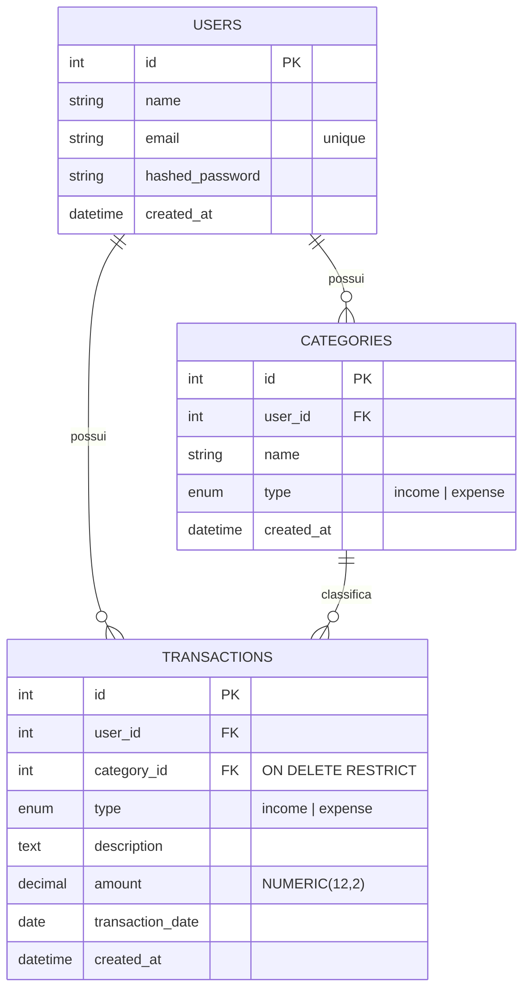

# 🗄️ Modelo de dados

As três tabelas do sistema, os relacionamentos entre elas e o significado de cada campo.

---

## 🗄️ Modelo de dados

O modelo de dados tem três tabelas. Não há hierarquia de categorias, múltiplas contas bancárias ou qualquer entidade além destas três.

### Relacionamentos, em linguagem natural

- **Um usuário possui várias categorias.** Cada categoria pertence a exatamente um usuário (`categories.user_id → users.id`). Não existe categoria compartilhada entre contas.
- **Um usuário possui várias transações.** Cada transação pertence a exatamente um usuário (`transactions.user_id → users.id`), independentemente da categoria usada.
- **Uma categoria pode ser referenciada por várias transações; uma transação referencia exatamente uma categoria.** Esse relacionamento (`transactions.category_id → categories.id`) usa `ON DELETE RESTRICT`: o banco recusa a exclusão de qualquer categoria que ainda tenha ao menos uma transação apontando para ela. A API traduz essa recusa em uma resposta `409 Conflict`.
- **O tipo (`income`/`expense`) é um único enum do PostgreSQL (`transaction_type`), compartilhado entre `categories.type` e `transactions.type`.** A regra "o tipo da transação deve ser igual ao tipo da categoria usada" não é imposta por uma constraint de banco entre as duas tabelas — é validada explicitamente na camada de serviço, tanto na criação quanto na edição de uma transação (ver [Regras de negócio](../../README.md#-regras-de-negócio)).

---

## 📚 Dicionário das entidades

### `users`

| Campo | Tipo | Obrigatório | Descrição |
| --- | --- | --- | --- |
| `id` | `int` (PK) | — | Identificador único, gerado pelo banco. |
| `name` | `string(255)` | Sim | Nome do usuário. |
| `email` | `string(255)` | Sim | E-mail do usuário. Único em todo o sistema (índice único). |
| `hashed_password` | `string(255)` | Sim | Hash bcrypt da senha. **Nunca** é retornado em nenhuma resposta da API. |
| `created_at` | `datetime` (com timezone) | — | Data/hora de criação da conta, definida automaticamente. |

### `categories`

| Campo | Tipo | Obrigatório | Descrição |
| --- | --- | --- | --- |
| `id` | `int` (PK) | — | Identificador único. |
| `user_id` | `int` (FK → `users.id`) | Sim | Dono da categoria. |
| `name` | `string(100)` | Sim | Nome da categoria (ex.: "Alimentação"). |
| `type` | `enum` (`income` \| `expense`) | Sim | Tipo fixo, definido na criação e **imutável** depois disso. |
| `created_at` | `datetime` (com timezone) | — | Data/hora de criação. |

Restrição de unicidade: `(user_id, name, type)` — o mesmo usuário não pode ter duas categorias com o mesmo nome **e** o mesmo tipo, mas pode reaproveitar um nome em tipos diferentes (ex.: "Outros" como receita e "Outros" como despesa são categorias distintas e válidas).

### `transactions`

| Campo | Tipo | Obrigatório | Descrição |
| --- | --- | --- | --- |
| `id` | `int` (PK) | — | Identificador único. |
| `user_id` | `int` (FK → `users.id`) | Sim | Dono da transação. |
| `category_id` | `int` (FK → `categories.id`, `ON DELETE RESTRICT`) | Sim | Categoria usada para classificar a transação. Deve pertencer ao mesmo usuário e ter o mesmo `type` da transação. |
| `type` | `enum` (`income` \| `expense`) | Sim | Tipo da transação. |
| `description` | `text` | Sim | Descrição livre (até 1000 caracteres na validação da API). |
| `amount` | `numeric(12,2)` | Sim | Valor monetário. Deve ser estritamente maior que zero e ter no máximo 2 casas decimais. Representado como `Decimal` em toda a aplicação — nunca `float`. |
| `transaction_date` | `date` | Sim | Data do lançamento financeiro, informada pelo usuário e independente de `created_at` (permite lançar uma transação retroativamente). |
| `created_at` | `datetime` (com timezone) | — | Momento em que o registro foi efetivamente criado no sistema. |

> Como essas entidades se movimentam em cada operação: [Principais fluxos](flows.md).

---

⬅️ [README](../../README.md) · 📚 [Índice da documentação](../README.md)
