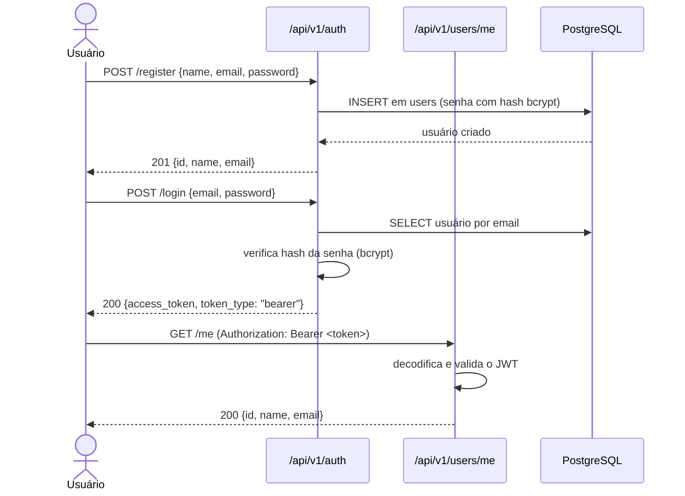
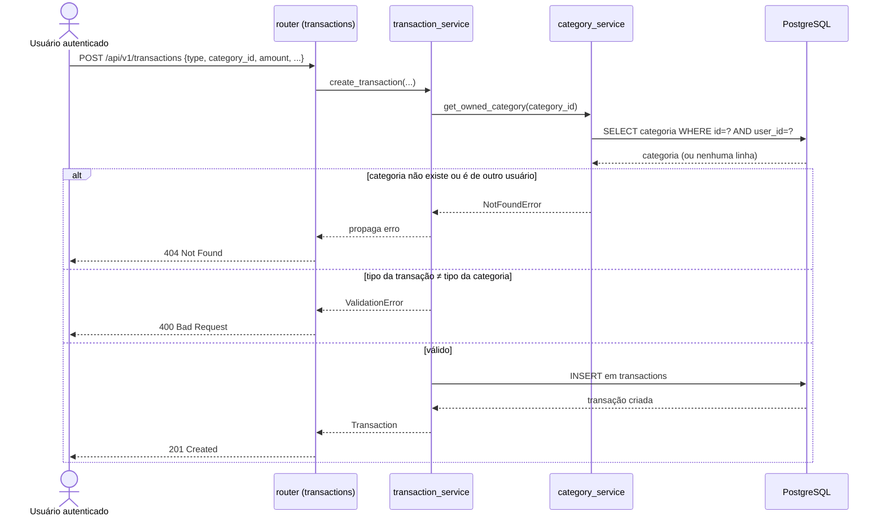
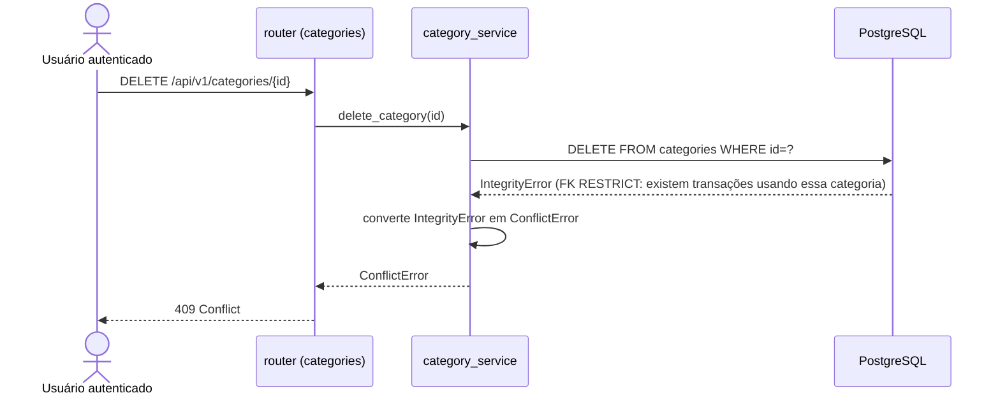

# 🔄 Principais fluxos

Os quatro caminhos que atravessam o sistema de ponta a ponta, do request HTTP até o PostgreSQL.

## 1. Registro, login e acesso autenticado

Quem inicia: um novo usuário. Endpoints: `POST /api/v1/auth/register`, `POST /api/v1/auth/login`, `GET /api/v1/users/me`.

Resultado: um token JWT válido por 60 minutos (sem refresh token — expirado, o único caminho é logar novamente).

## 2. Criar transação com validação de categoria

Quem inicia: um usuário autenticado. Endpoint: `POST /api/v1/transactions`. Entidades afetadas: `Transaction` (criada), `Category` (apenas consultada).

## 3. Excluir categoria em uso (bloqueio de integridade)

Quem inicia: um usuário autenticado. Endpoint: `DELETE /api/v1/categories/{category_id}`. Entidade afetada: `Category` (a exclusão é recusada).

Resultado: a categoria permanece intacta. Ela só pode ser excluída depois que todas as transações que a referenciam forem removidas ou reatribuídas a outra categoria.

## 4. Resumo financeiro de um período

Quem inicia: um usuário autenticado. Endpoint: `GET /api/v1/summary`. Entidades afetadas: nenhuma é alterada — apenas `Transaction` e `Category` são lidas.

O serviço filtra as transações do usuário autenticado dentro do intervalo `[start_date, end_date]`, soma receitas e despesas separadamente, conta os lançamentos de cada tipo, agrupa as despesas por categoria e calcula `balance = total_income - total_expenses` — tudo na mesma consulta, sem nenhum valor de saldo armazenado previamente.

> As entidades envolvidas estão descritas em [Modelo de dados](data-model.md); o contrato HTTP correspondente, em [API](api.md).

---

⬅️ [README](../../README.md) · 📚 [Índice da documentação](../README.md)
